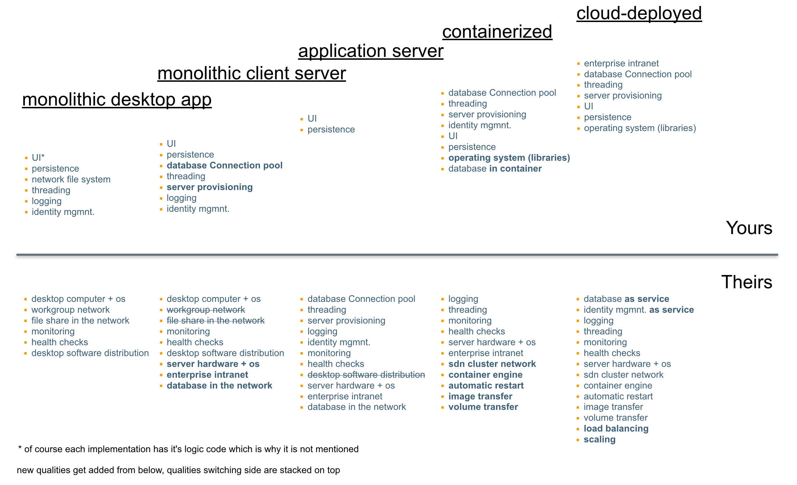

# News on architecture

>
The road behind

> 
## Serverless
>
A definition - anybody?
>
_"Serverless computing refers to the concept of building and running applications that do not require server management."_
 (KNative project)
 
>
_"It describes a finer-grained deployment model where applications, bundled as one or more functions, are uploaded to 
a platform and then executed, scaled, and billed in response to the exact demand needed at the moment"_
>
How does it affect my architecture?
>

## Perfect paradigms

* event-based
  * asynchronous
  * decoupling request working by queueing state
>
## Languages

All ..

* python
* node
* golang
* java
>
## Function as a service

* does not mean: functional programming
* but rather: function as entrypoint
>
## _source-to-URL_

(think about it - you will get the idea..)
>

## Twelve-Factor Apps

[12-Factor](https://12factor.net/)  

12 guidelines that foster the following principles..
>* Use declarative formats for setup automation, to minimize time and cost for new developers joining the project;
>* Have a clean contract with the underlying operating system, offering maximum portability between execution environments;
>* Be suitable for deployment on modern cloud platforms, obviating the need for servers and systems administration;
>* Minimize divergence between development and production, enabling continuous deployment for maximum agility;
>* Scale up without significant changes to tooling, architecture, or development practices.
>

## Cloud Eventing
>
### types
* eventing between containers
    * of the same kind:
        * scaled instances can sync each other
    * of different kind within a service architecture
        * publish/subscribe model decouples time of development
        * like a public API, just calling the other way 'round 
>        
### scaling support

* cloud events can trigger scaling
 * esp. scaling from zero 
 * that is the reason why events are first-level citizens in the cloud platform

* you are allowed to have other event mechanisms that are not observed by the platform
  * but send a cloud event to make sure the target is online
  
  
