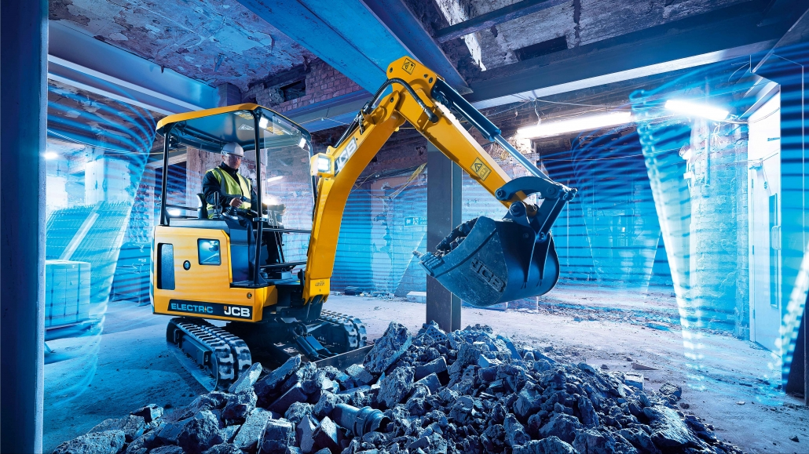

# A change is coming every now and then ..

Consider this ..
>
### Electric Excavator JCB 19C-1E

>
* 8 to 10 hours of digging, drilling, moving earth
* 1.8 kW loading on a 110V/16A outlet during night (10h) to fill again
    * use per day = 18kWh
    * equals 9l diesel produced by a small ac generator on the construction site
* compare this to model 19C
    * 20 litres diesel per day 
>
## Is it a bargain?

- down 50 percent on operational cost (fuel and maintenance)
- up 50 percent higher price at purchase

>
### How does an electric excavator compare to serverless computing?

* both use almost no power when not in action
* reduced maintenance cost 
* pay per use (especially when you rent it)
> 

### Serverless: operations

* auto-scaling with scale-to-zero
* pay per execution
* build-in monitoring
* revisions
>
### Serverless: development

* frameworks with focus on 
    * Rest API
    * eventing
    * delegated persistence (databases)
    * cloud services
* scaffolding for quick project setup
 
>
### Function-as-a-service platform

* means: logic only  
* which allows to scale computing bandwidth (logic processing)
* state and storage are externalized 
    * and will scale separately
>
### FAAS vendors and their platforms

* Microsoft Azure Functions
* Google Cloud Functions
* AWS Lambda
>

### what about state

* state?
    * workflow engines
    * databases (sql, nosql)
    * in-memory grids
    * object storage

* here and now: out of scope
