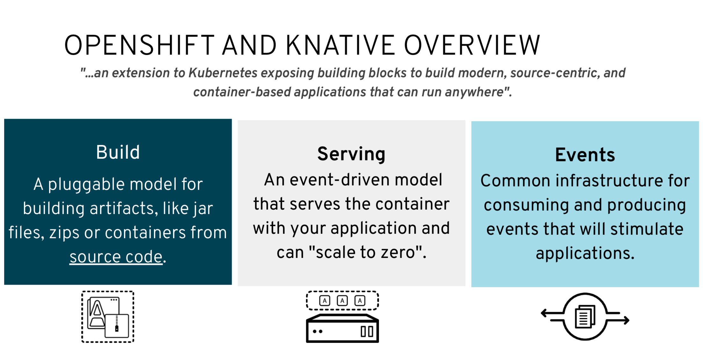

# KNative

>>
## Joined efforts by

* Google
* SAP
* IBM 
* Red Hat

KNative was created and is developed as Open source to
prevent vendor lock in on AWS Lambda Function-as-a-service offering
>>

## What does it cover?



## KNative building blocks
1. Service Revisions and alternative routes
2. Auto-scaling with scale-to-zero 
3. Eventing
>>
## _A day in the life_
* Deploying a container
* Orchestrating source-to-URL workflows on Kubernetes
* Routing and managing traffic with blue/green deployment
* Automatic scaling and sizing workloads based on demand
* Binding running services to eventing ecosystems

>>
# Service Revisions
>>
## Pinning

````
traffic:
  - tag: current
    revisionName: greeter-v1
    percent: 100
  - tag: prev
    revisionName: greeter-v2
    percent: 0
  - tag: latest
    latestRevision: true
    percent: 0 
````
>>
````
oc -n knativetutorial get ksvc greeter -oyaml \
  | yq r - 'status.traffic[*].url'
- http://current-greeter.knativetutorial.apps-crc.testing
- http://prev-greeter.knativetutorial.apps-crc.testing
- http://latest-greeter.knativetutorial.apps-crc.testing
````
>>
# Auto-scaling

    scale-to-zero-grace-period = 30s 
    stable-window = 60s
    autoscaling.knative.dev/minScale: "2"

    # Target 10 in-flight-requests per pod.
    autoscaling.knative.dev/target: "10"
    -> totalPodsToScale = inflightRequests / concurrencyTarget

>>
# Eventing
>>
## Kubernetes Custom Resources 

CRD = Custom Resource Definition API 
* allow Kubernetes to be extended in a modular fashion
  *  store and retrieve structured data and register under a cluster-wide name for decoupling by lookup
* provide a controller
  * create and implement a _declarative_ API on the resource  
  * declarative means: crud; non-transactional; describing rather than demanding; rarely updated, often by humans 

