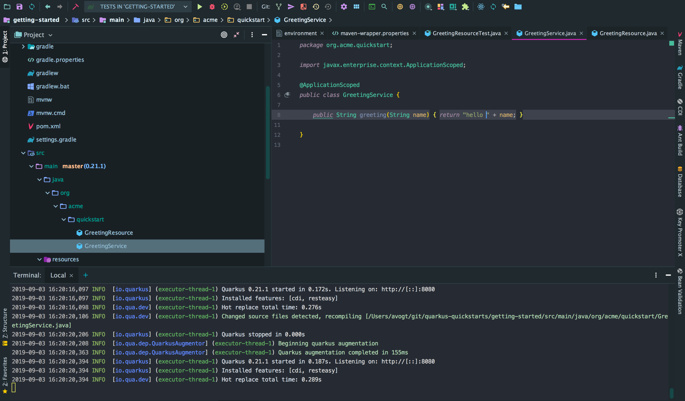

# Quarkus


_"A Kubernetes Native Java stack tailored for GraalVM & OpenJDK HotSpot, crafted from the best of breed Java libraries and standards"_
>>
# Building native
>>
## (1) Create your own builder image
>>
### (1.1) .. from Oracle's basic image

* Use Oracle's GraalVM image, then install native support.
* Name the container 'guimage'


    docker run --name gu-installer \
        bash -c 'gu install native-image'

* Save the container as new image (did you know that exists?)


    docker commit gu-installer  native-builder
    
>>   
 
### (1.2) Build native code within a container

````
docker run --rm -it \
       -v ~/git/quarkus-quickstarts/getting-started:/src \
       -v ~/.m2/:/root/.m2 native-image \
       bash -c  'cd /src && ./mvnw -Pnative package'
````

>>
## (1.1.b) Shorthand using the prepared builder image

* on your machine
````
    ./mvnw package -Pnative -Dnative-image.docker-build=true
````
* this will start a docker container to do the maven native build (like we did before)
 
>>
#### (2) Build a docker image 

* using the native output in your machine's `target/`folder (indicated by the dot `.` at the end)
* the Dockerfile was created via scaffolding (no worries)


    cd gettings-started
    docker build 
        -f src/main/docker/Dockerfile.native
        -t quarkus-quickstart/getting-started .
        
>>
####  (3) .. and run the application   
            
    docker run -i --rm -p 8080:8080 \ 
        quarkus-quickstart/getting-started

    INFO  [io.quarkus] (main) Quarkus 0.21.1 started in 0.011s. 
    Listening on: http://0.0.0.0:8080
    
    
>>
# Developing 
>>
## Detects code changes

* `./mvnw compile quarkus:dev`




