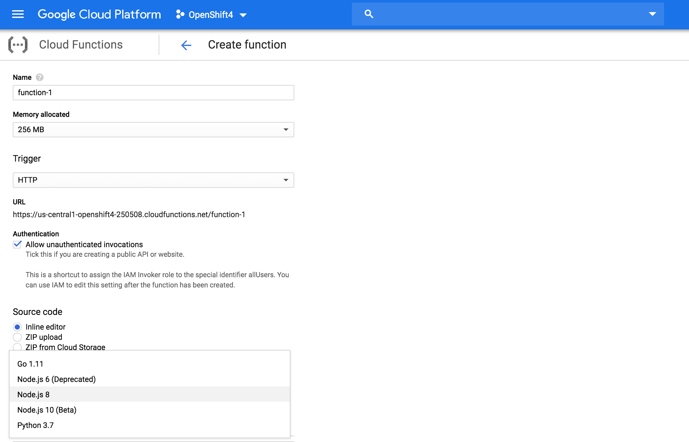
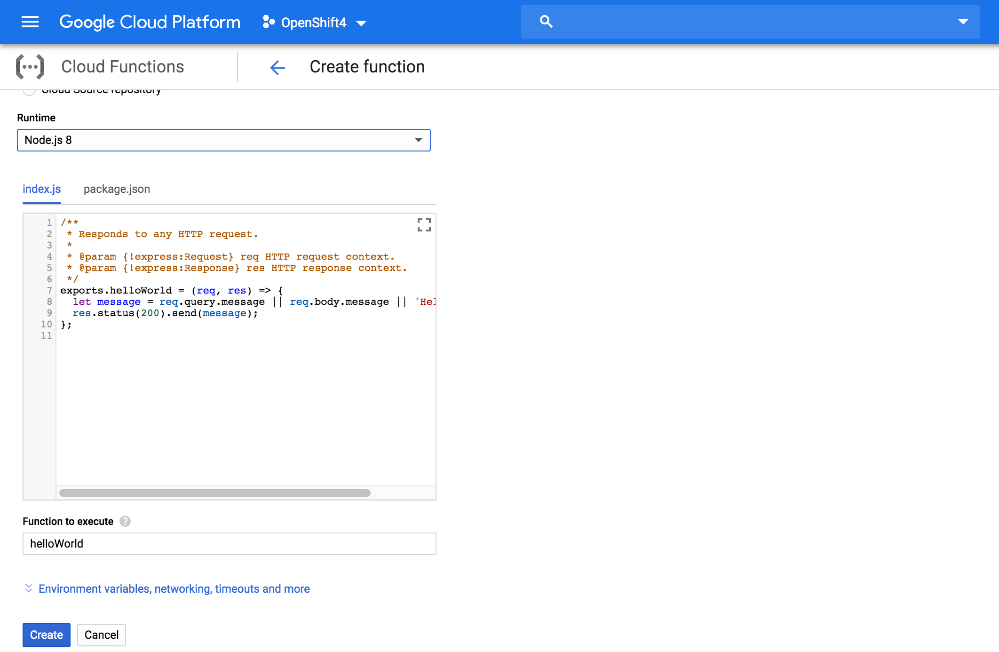
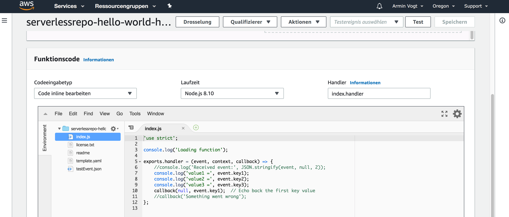

# The cloud vendors and their ways

>
# Google Functions
>
## Obtain a place..

>
## fill in the code ..
 

>
# Amazon AWS Lambda
>

>
## AWS is the pioneer

> "Lambda runs your code on high-availability compute infrastructure and performs all the administration of the compute resources, including server and operating system maintenance, capacity provisioning and automatic scaling, code and security patch deployment, and code monitoring and logging. All you need to do is supply the code." (Amazon)
# Cloud advantages

* serverless / function-as-a-service is prerequisite for
    * location based scaling
        * start the function near to the user's location
